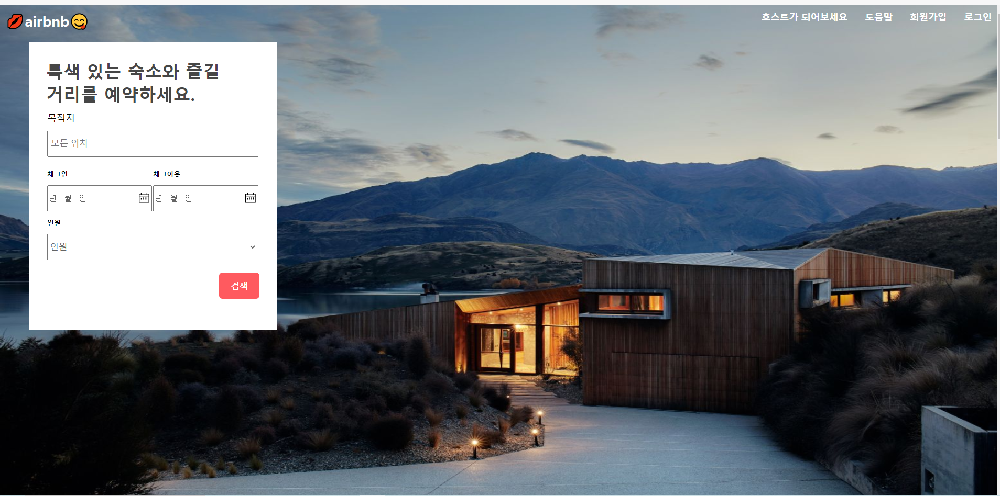
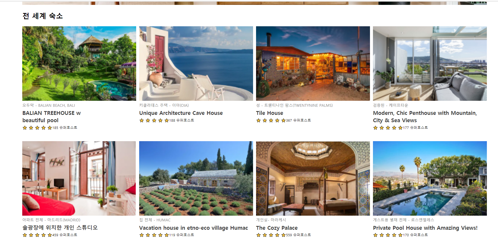

# Style-Components로 에어비앤비 화면 구현

### 설치

-npx create-react-app style-app

### 확장 프로그램 설치

-ESLint
-Prettier
-Reactjs code snippets

### .preffier 파일 생성

```json
{
  "singleQuote": true,
  "semi": true,
  "useTabs": false,
  "tabWidth": 2,
  "trailingComma": "all",
  "printWidth": 80
}
```

### 라이브러리

- npm install --save styled-components

### 화면 구현

_header.js, search.js_



_Main.js_



